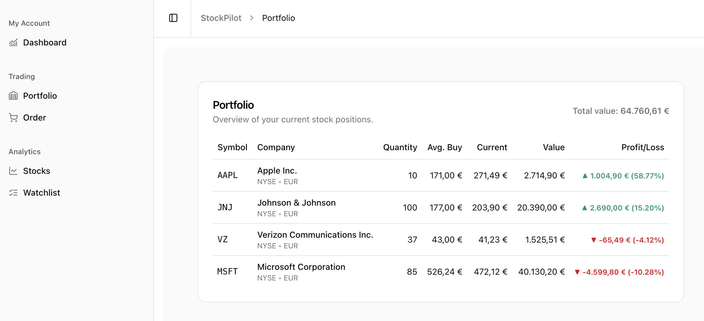
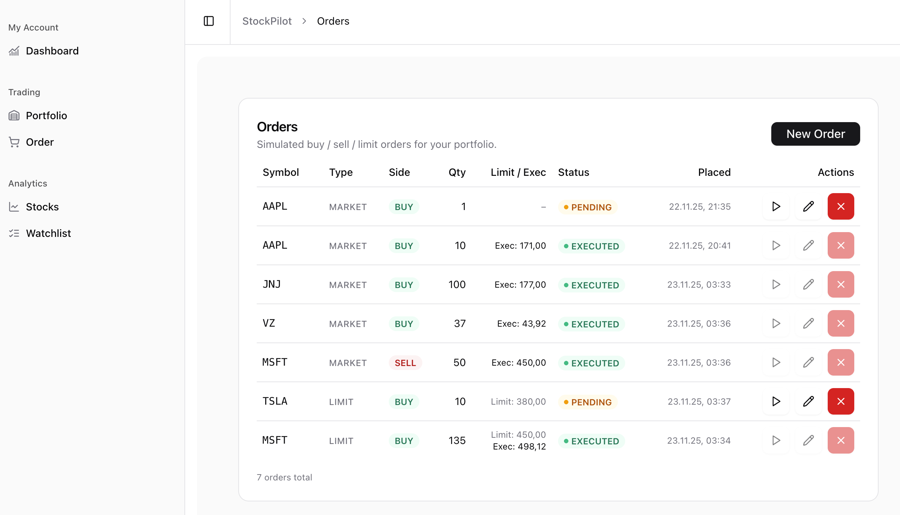
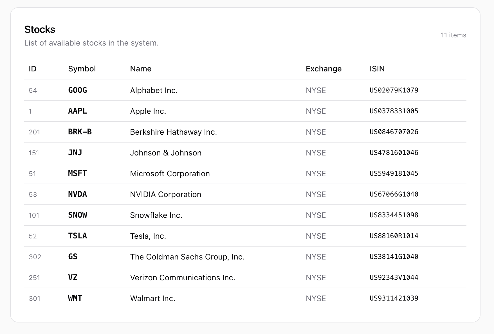
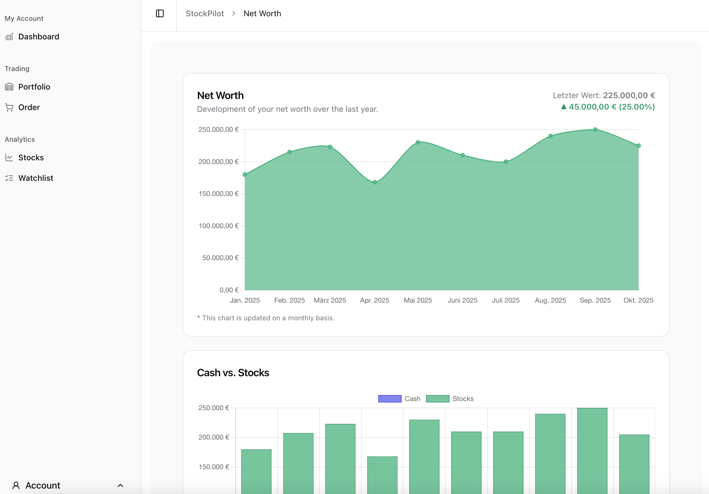
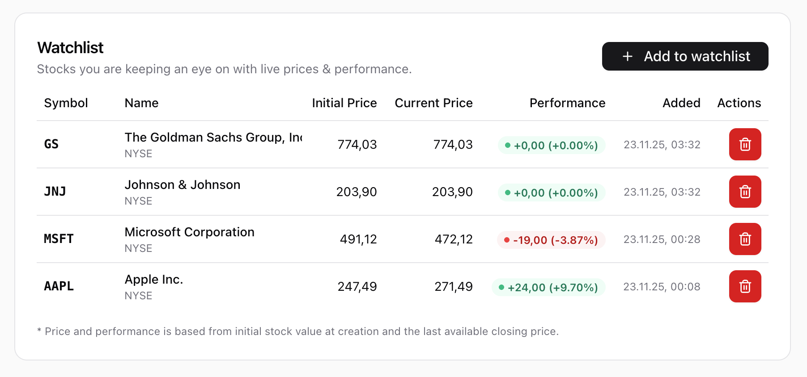

# StockPilot

StockPilot shows you where your money stands and where it's heading. With a clean portfolio view, automatic price updates, and smart trend analysis, you can make better financial decisions faster.

## Features

- Stock Portfolio
  - Calculate market value, profit and loss, avg buy price
- Order management
  - market, limit, stop, stop-limit order type
  - cancel or edit orders
  - manual execution
- Stock Watchlist
- Stock Details
  - Historical stock data
  - Chart
  - Performance in recent times
  - Overview of orders and positions

## Tech Stack
- Quarkus
- Postgresql
- Hibernate
- Typescript
- Vue.js
- ShadCn
- Tailwind
- Chart.js

## Screenshots

